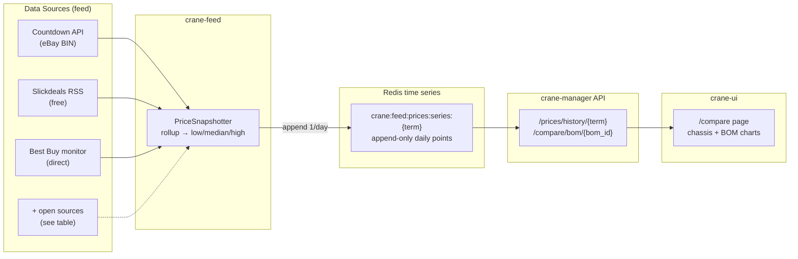
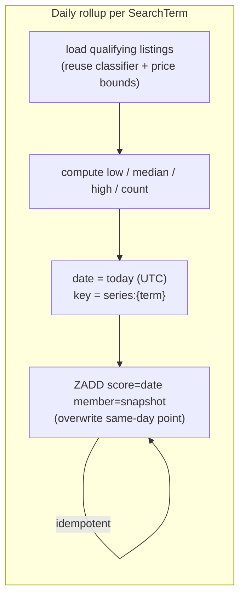
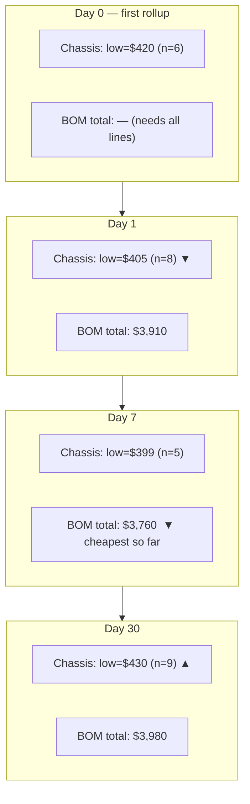
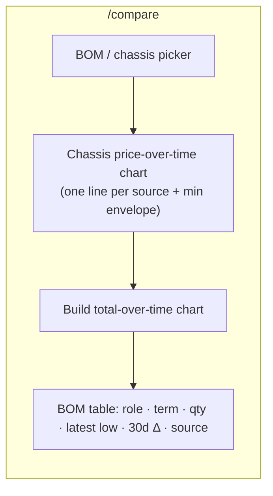

# Crane `/compare` — Historical Price Tracking Design

**Authors:** crane-monorepo maintainers
**Date:** 2026-08-19
**Status:** Draft for review

---

## Intent

Retool the `/compare` page (`crane-ui-gamma.onrender.com/compare`) so it tracks
**historical prices over time**, not just a live snapshot of current listings.

The anchor of the page is **one physical chassis** — the enclosure / barebones
unit — with its **surrounding components** (GPU, DRAM, NVMe, NIC) modeled as a
**bill of materials (BOM)**. `/compare` answers three questions:

1. What does *this chassis* cost right now, and how has that moved over weeks/months?
2. What does the *whole build* (chassis + BOM) cost over time?
3. Across sources (eBay / Best Buy / deal feeds), **who is cheapest, and when**?

Everything is grounded in **open and public sources** wherever possible
(see [Data Sources](#data-sources)); the existing paid Countdown eBay feed stays
as one input, not the only one.

---

## What "chassis + surrounding components" means

The system already tracks components as `SearchTerm`s
(`crane-feed/crane_feed/seed.py`): GPUs, DDR5, NVMe SSDs, NICs. Today they are a
flat list. We add **one composition layer** on top: a `BomSpec` that names a
chassis and the components that plug into it.

```
BomSpec: "1U GPU node"
  ├─ chassis      → Supermicro 1U GPU chassis      (anchor, qty 1)
  └─ components
       ├─ gpu     → nvidia a30 gpu                 (qty 2)
       ├─ dram    → ddr5 ecc rdimm 32gb            (qty 8)
       ├─ nvme    → Samsung 990 pro 2tb ssd        (qty 2)
       └─ nic     → mellanox connectx-6            (qty 1)
```

The **chassis** is the star of `/compare`; the BOM total is the second series.
Each line item reuses an existing `SearchTerm`, so no new polling machinery is
needed — only a new time series and a composition record.

---

## Source-to-Series Flow

The core new idea: a **snapshotter** that rolls the noisy stream of individual
listings into one **daily price point per product**, stored as a durable time
series. Live listings churn (7-day TTL); snapshots are permanent and cheap.



Mirrors the config-to-component pattern in the reference design: sources are
*type-checked inputs*, the snapshotter is the *dispatcher* that normalizes them,
and the UI consumes *instantiated* series.

---

## Core Types

New shared models in `crane-shared/crane_shared/models.py`.

```python
class PriceSnapshot(BaseModel):
    """One aggregated price observation for a product on a given day."""
    term_id: str          # which SearchTerm this rolls up
    source: str           # "ebay" | "bestbuy" | "slickdeals" | ...
    date: str             # YYYY-MM-DD (UTC), one point per source per day
    low: float            # cheapest qualifying listing
    median: float
    high: float
    sample_count: int     # listings behind this point (confidence)
    currency: str = "USD"

class BomLine(BaseModel):
    role: str             # "chassis" | "gpu" | "dram" | "nvme" | "nic"
    term_id: str          # existing SearchTerm to price
    qty: int = 1

class BomSpec(BaseModel):
    """A chassis plus the components that populate it."""
    bom_id: str
    name: str             # "1U GPU node"
    chassis_term_id: str  # the anchor line, priced most prominently
    lines: list[BomLine]  # includes the chassis line + components
    created_at: str
```

`PriceSnapshot` is deliberately **source-tagged** so `/compare` can draw one line
per source and pick the min. `sample_count` lets the UI fade low-confidence points.

---

## Snapshot Control Flow

Each rollup reads the *current* qualifying listings for a term (already computed
by `list_by_term`'s classifier + price filters) and writes **at most one point
per source per day** (idempotent — re-runs overwrite, never duplicate).



- **Storage:** a Redis **sorted set** per `(term, source)`, score = day epoch,
  member = JSON snapshot. Sorted sets give free dedup-by-day and range queries.
- **Trigger:** piggyback on the existing `crane-feed` poll loop — after the last
  poll of the UTC day, or a lightweight "have I snapshotted today?" check each
  cycle (`dedup_check` already exists in `RedisClient`). No new service.
- **Backfill:** on first deploy, seed points from whatever per-listing history
  exists so the chart isn't empty on day one.

---

## Historical Progression (worked example)

How the chassis series fills in over successive rollups — same "state updates
one step at a time" idea as the reference doc's inventory example, but the state
here is the **price series** and each day appends one point.



The BOM total at each day = Σ (per-line cheapest snapshot on that day × qty),
carried forward when a line has no fresh point that day.

---

## Data Sources

Keep the current three; add open/public ones to reduce reliance on the paid feed
and to widen coverage of chassis + components.

| Source | Access | Covers | Notes |
|---|---|---|---|
| Countdown API (eBay) | paid key (present) | all terms, BIN | already wired; primary |
| Slickdeals RSS | **free/public** | BB / Amazon / Newegg deals | already wired |
| Best Buy product monitor | **public pages** | tracked SKUs | already wired |
| eBay Browse API | **free tier** (OAuth) | listings, sold comps | official, replaces some Countdown calls |
| Newegg / provantage / server-part vendors | **public product pages** | chassis, barebones | scrape politely; good for enclosures |
| PCPartPicker price history | **public pages** | consumer components | strong historical baseline for BOM lines |
| Amazon (Keepa/CamelCamelCamel style) | public/affiliate | components | historical anchor if key available |

Adapters plug into the **same `PriceSnapshotter`** — each yields
`(term_id, source, price)` tuples; the snapshotter owns rollup + dedup. Adding a
source is one adapter, no schema change (the "can replace / can extend" property
from the reference design).

---

## API additions (`crane-manager`)

```
GET /prices/history/{term_id}?source=&from=&to=&limit=
      → [PriceSnapshot, ...]                      # one product's series

GET /prices/compare/{term_id}
      → { term_id, sources: { ebay:[...], bestbuy:[...] }, best:[...] }
                                                   # per-source + min-envelope

GET /compare/boms                                 # list BomSpecs
POST /compare/boms                                # create/update a BomSpec
GET /compare/bom/{bom_id}/history?from=&to=
      → { chassis:[...], lines:[{role,term_id,series:[...]}], total:[...] }
```

`from/to` default to last 90 days. Follows the existing router style in
`crane_manager/api/*.py`; add `prices.py` + `compare.py`, register in `main.py`.

Frontend client: extend `crane-ui/src/services/api.ts` with `getPriceHistory`,
`getCompare`, `getBomHistory`; add `PriceSnapshot` / `BomSpec` to `types.ts`.

---

## `/compare` page

New route in `crane-ui/src/App.tsx` (`/compare` → `ComparePage`) plus a nav link.



- **Hero chart:** the chassis series, multi-source, min-price envelope highlighted.
  Reuse `components/PriceChart.tsx`.
- **Total chart:** BOM total over time; toggle line items on/off.
- **Table:** each BOM line with latest low, 30-day delta, and which source is
  cheapest — click a row to drill into that component's history.
- Styling matches the existing dark terminal theme (see `PricesPage.tsx`).

---

## Phasing

1. **Series backbone** — `PriceSnapshot` model, `PriceSnapshotter` in feed
   (rolls up eBay listings already in Redis), `/prices/history/{term}` endpoint.
   Deliverable: any tracked term charts a real time series.
2. **`/compare` MVP** — route + page, chassis picker (single term), hero chart
   from step 1. No BOM yet.
3. **BOM layer** — `BomSpec` model + CRUD, total-over-time, BOM table.
4. **More sources** — eBay Browse API + one chassis-focused public vendor as new
   snapshotter adapters; multi-source envelope on the hero chart.

Each phase is independently shippable and leaves `/compare` working.

---

## Open questions

- **Which exact chassis** is the anchor? (Need a concrete SKU/search term to seed
  `chassis_term_id`; current seeds have no enclosure yet.)
- **Rollup cadence** — daily is proposed; is finer (hourly) wanted for volatile
  GPU listings, at the cost of a bigger series?
- **Sold vs. listed** — track asking prices (listings) only, or also realized
  sold-comps (eBay Browse supports it)? Sold comps are a truer "market price."
